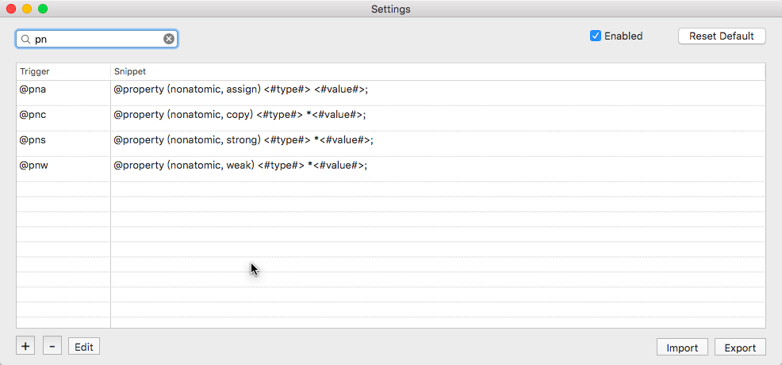

# HKSnippet - Xcode plug-in

HKSnippet is a xcode plug-in for creating code snippet with triggers strings.


## What Can it do ?
 - minimize input for often used code snippet.
 - define your own trigger & snippet.
 - export & import your customized snippet to and from config file.
 - support undo - redo operation.


## Install

- The recommanded way to install HKSnippet is to use [Alcatraz](http://alcatraz.io/). Install Alcatraz followed by the instruction, restart your Xcode. You can find `HKSnippet` in the list. Just click the install button.

- another way is to clone this repo, Build the project and it's done!

- or you can also download from [this link](http://exibitioncenter-data.stor.sinaapp.com/download%2FHKSnippet.xcplugin.zip) and move the plugin to path  
 `~/Library/Application Support/Developer/Shared/Xcode/Plug-ins/`  
 then restart Xcode

## Usage

This plug-in is very easy to use. By typing the trigger string , you will get the corresponding snippet.

for example , you want to write a property with noatomic and strong, you can type **@pns**
 , and you will get 

@property (noatomic, strong) <#type#> *<#name#>


The belowing part is pre-defined triggers and snippet :

* Strong

```
@ps 	@property (strong) type *value; 

@prs	@property (strong, readonly) type *value;

@pns	@property (noatomic, strong) type *value;

@prns	@property (nonatomic, strong, readonly) type *value;


```

* Weak

```
@pw 	@property (weak) type *value; 

@prw	@property (weak, readonly) type *value;

@pnw	@property (noatomic, weak) type *value;

@prnw	@property (nonatomic, weak, readonly) type *value;

```

* Copy

```
@pc 	@property (copy) type *value; 

@prc	@property (copy, readonly) type *value;

@pnc	@property (noatomic, copy) type *value;

@prnc	@property (nonatomic, copy, readonly) type *value;

```

* Assign

```
@pa 	@property (assign) type *value; 

@pra	@property (assign, readonly) type *value;

@pna	@property (noatomic, assign) type *value;

@prna	@property (nonatomic, assign, readonly) type *value;

```
* @ff - General Getter 

```
@ff 	

- (type *)name {
    if(!_name) {
        //Init Code
    }
    return _name;
}

```


* @fv - UIView Getter 

```
 @fv

- (UIView *)name {
    if(!_name) {
        _name = [UIView new];
        _name.backgroundColor = color;
    }
    return _name;
} 

```

* @fl - UILabel Getter

```
@fl	

- (UILabel *)name {
    if(!_name) {
        _name = [UILabel new];
        _name.backgroundColor = [UIColor clearColor];
        _name.textAlignment = NSTextAlignmentCenter;
        _name.numberOfLines = 0;
        _name.textColor = color;
        _name.font = font;
        _name.text = text;
    }
    return _name;
}

```

* @fi - UIImageView Getter

```
@fi

- (UIImageView *)name {
    if(!_name) {
        _name = [UIImageView new];
        _name.layer.cornerRadius = radius;
        _name.layer.masksToBounds = YES;
        _name.backgroundColor = [UIColor clearColor];
        _name.image = image;
    }
    return _name;
}

```

* @fb - UIButton Getter

```
@fb

- (UIButton *)name {
    if(!_name) {
        _name = [UIButton new];
        _name.layer.cornerRadius = radius;
        _name.layer.masksToBounds = YES;
        _name.backgroundColor = [UIColor clearColor];
        [_name setTitleColor:title color forState:UIControlStateNormal];
        [_name setTitle: title  forState:UIControlStateNormal];
        [_name setImage:image forState:UIControlStateNormal];
    }
    return _name;
}

```

* @ft - UITableView Getter

```
@ft

- (UITableView *)name {
    if(!_name) {
        _name = [[UITableView alloc] initWithFrame:CGRectZero style:UITableViewStyleGrouped];
        _name.backgroundColor = [UIColor clearColor];
        _name.contentInset = UIEdgeInsetsMake(0, 0, 0, 0);
        _name.separatorStyle = UITableViewCellSeparatorStyleSingleLine;
        _name.separatorColor = color;
        _name.delegate = table delegate;
        _name.dataSource = table datasource;

        [_name registerClass:[class name class] forCellReuseIdentifier:cellId];
    }
    return _name;
}

```

* Declear

```
@cs		static NSString * const name = @\"value\";

@log	NSLog(@\"format\",data);

@ws		__weak typeof(self) weakSelf = self;

@ss		__strong typeof(weakSelf) strongSelf = weakSelf;

@mk		#pragma mark - section title

@pmk	#pragma mark - Private Method

@lmk	#pragma mark - LifeCycle

@gmk	#pragma mark - Getters & Setters

```

* @lv - LoadView

```
@lv

- (void)loadView {
    [super loadView];
}

```

* @ls - Layout Subviews

```
@ls

- (void)layoutSubviews {
    [super layoutSubviews];
    CGFloat w = self.frame.size.width;
    CGFloat h = self.frame.size.height;
    //set subview frames
}

```

* @vl - ViewWillLayoutSubviews

```
@vl

- (void)viewWillLayoutSubviews {
    [super viewWillLayoutSubviews];
    CGFloat w = self.frame.size.width;
    CGFloat h = self.frame.size.height;
    //set subview frames 
}

```

* @init - Initialization

```
@init

- (instancetype)init {
    self = [super init];
    if (self) {
        //statements
    }
    return self;
}

```

* @de - De-Init

```
@de

- (void)dealloc {
    [[NSNotificationCenter defaultCenter] removeObserver:self];
}

```

* @table -  UITableView Delegate & Datasource

```
@table

#pragma mark - UITableViewDataSource
- (NSInteger)tableView:(UITableView *)tableView numberOfRowsInSection:(NSInteger)section {
    return rows;
}

- (UITableViewCell *)tableView:(UITableView *)tableView cellForRowAtIndexPath:(NSIndexPath *)indexPath {

    UITableViewCell *cell = [self.tableView dequeueReusableCellWithIdentifier:CellId];

    return cell;
}

#pragma mark - UITableViewDelegate
- (CGFloat)tableView:(UITableView *)tableView heightForRowAtIndexPath:(NSIndexPath *)indexPath {
    return height;
}

- (void)tableView:(UITableView *)tableView didSelectRowAtIndexPath:(NSIndexPath *)indexPath {
    [tableView deselectRowAtIndexPath:indexPath animated:YES];

}

```

## Setting
After the install of the plug-in ,you will find the menu in the top "Plugins -> HKSnippet", Click that menu, you can see the belowing pannel where you can define your own triggers or edit the existing triggers & snippets.

You can alse export your trigger & sniippet to a configuration file which can be use to share with others. 





## LICENCE

HKSnippet is available under the MIT license. See the LICENSE file for more info.
